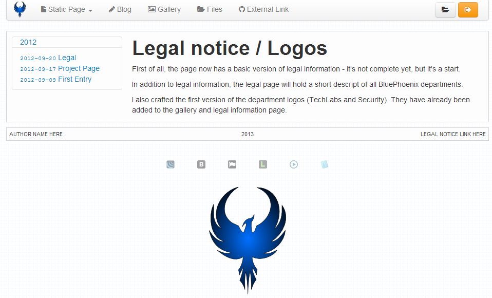

# Minimal File Manager

    

### Description
This is a very small file browser aimed to be integrated in your project. Right
now this example is built on top of Silex since I develop it together with
[Phoenix-Tpl](https://github.com/W4RH4WK/Phoenix-Tpl). This README will show
the important files.

### Features
 - Browse directories
 - Open files
 - Edit files (ckeditor)
 - Move / rename files and folders
 - Remove files and empty folders
 - Create a new folder
 - Create an empty file
 - Upload multiple files at once (HTML5)

### Important Files
 - `app/FileManager.php` server side logic (includes URL routing)
 - `tpl/filemanager.html.twig` HTML template
 - `web/assets/filemanager.js` client side javascript logic
 - `web/assets/editor.js` client side editor stuff
 - `web/assets/default.css` custom CSS stuff

### Installation
[Composer](http://getcomposer.org/) is used for the installation so process.
The `composer.json` file is part of the project just run composer.

    $ git clone git://github.com/W4RH4WK/MinimalFileManager fm
    $ cd fm
    $ composer install

Change the url inside the `app/app.php`.

    $app['url'] = 'http://example.org/';

Point your web server to the `web` directory.

See [Phoenix-Tpl](https://github.com/W4RH4WK/Phoenix-Tpl) for more information.

### Used Components
 - [Bootstrap](http://twitter.github.com/bootstrap/)
 - [CKEditor](http://ckeditor.com/)
 - [Font Awesome](http://fortawesome.github.com/Font-Awesome/)
 - [Jquery](http://jquery.com/)
 - [Markdown](http://michelf.ca/projects/php-markdown/)

### License
I provide assets like bootstrap and flowplayer as they are to ensure better out
of the box experience. This way you do not have to install them manually.

    Copyright (c) 2013 Alex W4RH4WK Hirsch

    This program is free software: you can redistribute it and/or modify
    it under the terms of the GNU General Public License as published by
    the Free Software Foundation, either version 3 of the License, or
    (at your option) any later version.

    This program is distributed in the hope that it will be useful,
    but WITHOUT ANY WARRANTY; without even the implied warranty of
    MERCHANTABILITY or FITNESS FOR A PARTICULAR PURPOSE.  See the
    GNU General Public License for more details.

    You should have received a copy of the GNU General Public License
    along with this program.  If not, see <http://www.gnu.org/licenses/>.
